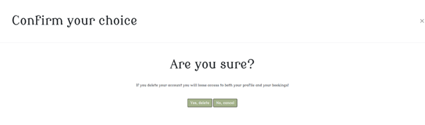
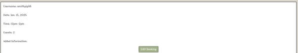

# The Lucky Roll Cafe


## Table of Contents

- [Introduction](#introduction)
- [Design](#design)
- [Features](#features)
- [User Stories](#user-stories)
- [Languages](#languages)
- [Database](#database)
- [Agile Design Principles](#agile-design-principles)
- [Testing](#testing)
- [Deployment](#deployment)
- [Credits](#credits)

## Introduction

The focus of this site was to implement the django framework and python on the back-end in order to create a user-friendly site. The site is a board game cafe site, where the user is able to create, edit and delete a user account along with the ability to book a specific type of table dependent on the users needs. As per the scope of the project, CRUD (create, read, update and delete) ideology was followed and the user is able to edit and delete their booking if they so wish to. The site has an admin panel for the business owner to allow messages to be sent by the user for any additional requests (table location, food requirements etc.)

## Design

The idea behind the design for the site was simplicity and functionality presented in an appealing and intuitive manner. Users who would be brought to the site are likely to know what they want and the design encourages them to use the site. Navigation throughout the site is intuitive with functions such as being able to access the nav-bar at all times and having messages appear to let them know a certain request has been successful or unsuccessful. I thought about the customer base for this type of business and wanted a historic and old feel to the site.

### Color Scheme

I choose a color scheme that fit with the theme of coffee and board games. I found I color scheme that fitted my theme from [coolors.com](https://coolors.co/dad7cd-a3b18a-588157-3a5a40-344e41)

### Font

My font was chosen from [googlefonts](https://fonts.google.com/specimen/Modern+Antiqua) - I chose Modern Antiqua as it fell under the medieval filter on google fonts and this links suitably with the historic feel I initially desired.

### Wireframes

I used the [Balsamiq](https://balsamiq.com/) wireframing tool to design simple mock-ups of my site to give me an initial idea of how the site layout should be.


## Features

### Site Pages

The following examples are screenshots of the various pages on my site.

### Home page

This is where the user will first land on the site, it leads them to either registering if it their first time visiting the site. A user must register in order to view any details. Or if they alreay have an account, they can proceed to the login page.


### About page

This page includes information about what the cafe provides. It enables users to go directly to the booking form if the so wish, it includes a small selection of what games are on offer in the cafe and a drinks menu too.


### Booking page

On this page, a logged in user is able to choose details for their booking at the cafe. The user has to include details of the type of table they so require, a date of booking, which has been designed so they cannot book in the past, a choice of time slots are avaliable, number of guests (with the maximum being 12) and a place where the user can disclosure any further requirements.


### My Profile page

In this section of the site a user is able to update their information, such as username, first name and last name. If they so wish a user is able to find out information about restting their password on this page too. The ability to delete their account is also included on this page with a modal appearing confirming if a user is sure they want this action to occur.


### My Bookings page

This page displays all bookings that a user has made. They appear with two functions, the ability to edit or delete a booking.


### User actions

User registration


User login


User logout


Password reset


User profile edit


Delete profile



Book a table


Edit a booking



Delete a booking


### Future features

#### Game review 

A page on the site where a user can post their own experience of a board game. This would be akin to Trip Advisor, with a rating system, the ability to post a photo and a text area where the user can offer their opinion.

#### Comprehensive message to business owners function

This would be an area of the site where a user can make board game recoomendations, ideas for events/theme nights etc directly to the owner. 

## User Stories

All of user stories can be located in the liked GitHub project [here](https://github.com/users/smithphil88/projects/3).

## Languages

Technologies used;

- [HTML](https://en.wikipedia.org/wiki/HTML) used for the main site content.
- [CSS](https://en.wikipedia.org/wiki/CSS) used for the main site design and layout.
- [Python](https://www.python.org) used as the back-end programming language.
- [Git](https://git-scm.com) used for version control. (`git add`, `git commit`, `git push`)
- [GitHub](https://github.com) used for secure online code storage.
- [Gitpod](https://gitpod.io) used as a cloud-based IDE for development.
- [Bootstrap](https://getbootstrap.com) used as the front-end CSS framework for modern responsiveness and pre-built components.
- [Django](https://www.djangoproject.com) used as the Python framework for the site.
- [PostgreSQL](https://www.postgresql.org) used as the relational database management.
- [Heroku](https://www.heroku.com) used for hosting the deployed site.
- [Cloudinary](https://cloudinary.com) used for online static file storage.
- [Gunicorn](https://gunicorn.org/) used for WSGI server

## Database

Lucid chart image


## Agile design principles

### Github Projects

[Github Projects](https://github.com/smithphil88/the_lucky_roll_cafe/projects?query=is%3Aopen) was utilised as an Agile design tool throughout this project. Using the right tags, issues and assignments, it served to promote efficient and effective Agile design principles.

User issues were created and issues and tasks were planned and referred back to over the course of the project using this Kanban Board.

The [MoSCoW](https://en.wikipedia.org/wiki/MoSCoW_method) method was used to assist with the organisation of the project, it helped prioritise certain tasks and leave tasks until the end that were not needed for the scope of this assessement.


Github Issues

[Github Issues](https://github.com/smithphil88/the_lucky_roll_cafe/issues) was used alongside Github Projects. This was how I created my user stories, using a custom template that served my purposes.

[Closed Issues](https://github.com/smithphil88/the_lucky_roll_cafe/issues?q=is%3Aissue%20state%3Aclosed)


[Open Issues](https://github.com/smithphil88/the_lucky_roll_cafe/issues)


## Testing

For all testing, please refer to the [TESTING.md](TESTING.md) file.

## Deployment

The live deployed application can be found deployed on [Heroku](https://the-lucky-roll-b5e404f4335f.herokuapp.com/).

### Heroku Deployment

This project uses [Heroku](https://www.heroku.com), a platform as a service (PaaS) that enables developers to build, run, and operate applications entirely in the cloud.

Deployment steps are as follows, after account setup:

- Select **New** in the top-right corner of your Heroku Dashboard, and select **Create new app** from the dropdown menu.
- Your app name must be unique, and then choose a region closest to you (EU or USA), and finally, select **Create App**.
- From the new app **Settings**, click **Reveal Config Vars**, and set your environment variables.

| Key | Value |
| --- | --- |
| `CLOUDINARY_URL` | user's own value |
| `DATABASE_URL` | user's own value |
| `DISABLE_COLLECTSTATIC` | 1 (*this is temporary, and can be removed for the final deployment*) |
| `SECRET_KEY` | user's own value |

Heroku needs two additional files in order to deploy properly.
- requirements.txt
- Procfile

You can install this project's **requirements** (where applicable) using:
- `pip3 install -r requirements.txt`

If you have your own packages that have been installed, then the requirements file needs updated using:
- `pip3 freeze --local > requirements.txt`

The **Procfile** can be created with the following command:
- `echo web: gunicorn app_name.wsgi > Procfile`
- *replace **app_name** with the name of your primary Django app name; the folder where settings.py is located*

For Heroku deployment, follow these steps to connect your own GitHub repository to the newly created app:

Either:
- Select **Automatic Deployment** from the Heroku app.

Or:
- In the Terminal/CLI, connect to Heroku using this command: `heroku login -i`
- Set the remote for Heroku: `heroku git:remote -a app_name` (replace *app_name* with your app name)
- After performing the standard Git `add`, `commit`, and `push` to GitHub, you can now type:
	- `git push heroku main`

The project should now be connected and deployed to Heroku!

### Local Deployment

This project can be cloned or forked in order to make a local copy on your own system.

For either method, you will need to install any applicable packages found within the *requirements.txt* file.
- `pip3 install -r requirements.txt`.

You will need to create a new file called `env.py` at the root-level,
and include the same environment variables listed above from the Heroku deployment steps.

Sample `env.py` file:

```python
import os

os.environ.setdefault("CLOUDINARY_URL", "user's own value")
os.environ.setdefault("DATABASE_URL", "user's own value")
os.environ.setdefault("SECRET_KEY", "user's own value")

# local environment only (do not include these in production/deployment!)
os.environ.setdefault("DEBUG", "True")
```

Once the project is cloned or forked, in order to run it locally, you'll need to follow these steps:
- Start the Django app: `python3 manage.py runserver`
- Stop the app once it's loaded: `CTRL+C` or `⌘+C` (Mac)
- Make any necessary migrations: `python3 manage.py makemigrations`
- Migrate the data to the database: `python3 manage.py migrate`
- Create a superuser: `python3 manage.py createsuperuser`
- Load fixtures (if applicable): `python3 manage.py loaddata file-name.json` (repeat for each file)
- Everything should be ready now, so run the Django app again: `python3 manage.py runserver`

#### Cloning

You can clone the repository by following these steps:

1. Go to the [GitHub repository](https://github.com/smithphil88/the_lucky_roll_cafe) 
2. Locate the Code button above the list of files and click it 
3. Select if you prefer to clone using HTTPS, SSH, or GitHub CLI and click the copy button to copy the URL to your clipboard
4. Open Git Bash or Terminal
5. Change the current working directory to the one where you want the cloned directory
6. In your IDE Terminal, type the following command to clone my repository:
	- `git clone https://github.com/smithphil88/the_lucky_roll_cafe`
7. Press Enter to create your local clone.

Alternatively, if using Gitpod, you can click below to create your own workspace using this repository.

[](https://github.com/smithphil88/the_lucky_roll_cafe)

#### Forking

By forking the GitHub Repository, we make a copy of the original repository on our GitHub account to view and/or make changes without affecting the original owner's repository.
You can fork this repository by using the following steps:

1. Log in to GitHub and locate the [GitHub Repository](https://github.com/smithphil88/the_lucky_roll_cafe)
2. At the top of the Repository (not top of page) just above the "Settings" Button on the menu, locate the "Fork" Button.
3. Once clicked, you should now have a copy of the original repository in your own GitHub account!

## Credits

### Content

| Source | Comments |
| --- | --- |
| [Flexbox Froggy](https://flexboxfroggy.com/) | modern responsive layouts |
| [W3 Schools](https://www.w3schools.com/django/index.php) | django basics |
| [Youtube](https://www.youtube.com/watch?v=B40bteAMM_M&list=PLCC34OHNcOtr025c1kHSPrnP18YPB-NFi) | how to style forms and create custom profile pages |
| [Django documentation ](https://docs.djangoproject.com/en/5.1/) | how to inlcude different types of fields |
| [PEP8](https://peps.python.org/pep-0008/#introduction) | help to fix issues occuring during the python linter |
| [Bootstrap](https://getbootstrap.com/) | various bootstrap help inc modals, navbar and card assistance |
| [Materialize](https://materializecss.com/footer.html) | fix to footer |
| [MarsDevs](https://www.marsdevs.com/blogs/learn-django-tips-tricks-techniques-for-developers#things-to-know-about-django) | how to set up a djanog project |
| [Social Dice](https://www.socialdice.co.uk/) | inspiration for some of the content |
| [Common Meeple](https://www.commonmeeple.co.uk/) | inspiration for some of the content |
| [Chance & Counters](https://www.chanceandcounters.com/cardiff/) | inspiration for some of the content |

### Media & Images

| Source | Location | Type |
| --- | --- | --- |
| [Unsplash](https://unsplash.com/photos/selective-focus-photography-of-chess-pieces-G1yhU1Ej-9A) | see our games modal - chess | image |
| [Pexels](https://www.pexels.com/photo/a-cup-of-coffee-on-white-saucer-7362647/) | landing page | image |
| [Unsplash](https://www.pexels.com/photo/scrabble-board-game-on-shallow-focus-lens-1153929/) | see our games modal - scrabble | image |
| [Unsplash](https://unsplash.com/photos/red-white-yellow-and-green-abstract-painting-BDIFIT1ILDs) | see our games modal - risk | image |
| [Unsplash](https://unsplash.com/photos/a-group-of-gold-dices-sitting-on-top-of-a-table-UM6vbyYfyJ0) | see our games modal - d&d | image |
| [Pexels](https://www.pexels.com/photo/colorful-dice-on-table-8111249/) | landing page | image |
| [Pexels](https://www.pexels.com/photo/close-up-of-coffee-cup-324028/) | see our menu image | image |
| [Traitors shop](https://www.thetraitors.tv/shop/p/board_game) | see our games modal - traitors | image |
| [Youtube](https://www.youtube.com/@Imitating/search?query=throw%20throw) | see our games modal - throw throw burrito | image |
| [Unsplash](https://unsplash.com/photos/white-and-brown-labeled-box-Ey7i2tHVV5E) | see our games modal - monopoly | image |
| [Pexels](https://pexels.com/photo/close-up-photo-of-monopoly-board-game-776654/) | book now link | image |
| [Unsplash](https://unsplash.com/photos/a-couple-of-chairs-that-are-sitting-in-front-of-a-table-gdtu3zwVCb4) | see our games | image |
| [Etsy](https://www.etsy.com/uk/listing/1040029036/coffee-menu-template-drinks-menu-cafe) | coffee menu | image |

### Acknowledgements

- I would like to thank the tutors at Code Institute for helping me throughout the project on various debugging assistance.
- I would like to thank my tutor Julia for her support.
- Thank you to my cohort facilitator Lewis for his guidance.
- And thank you to my partner, Emma, for her complete support and bringing me cups of coffee when they were really needed.


