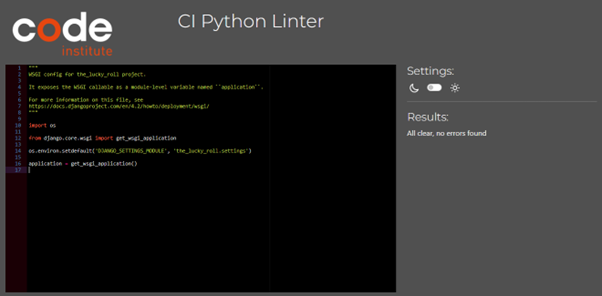
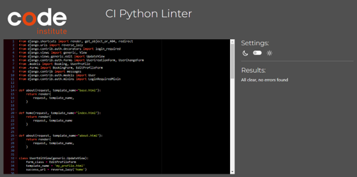
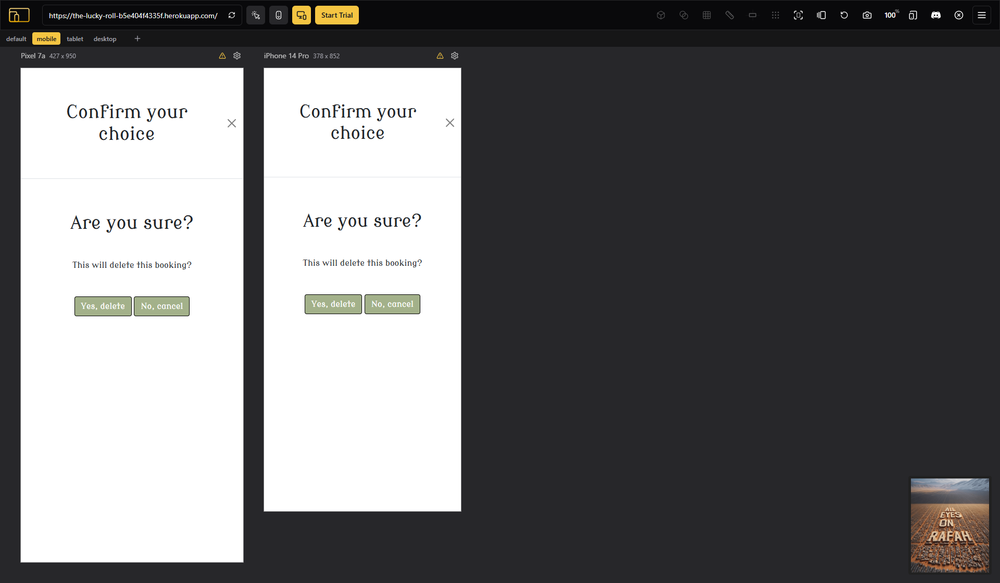
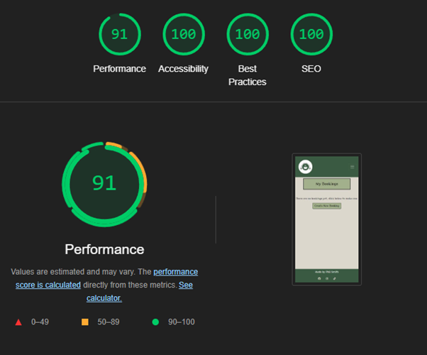
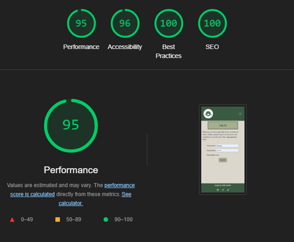
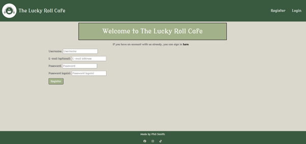
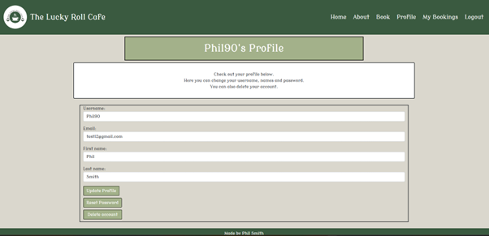
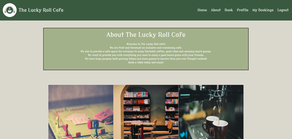

# Testing

Return back to the [README.md](README.md) file.

## HTML Validation

I used the [HTML W3C Validator](https://validator.w3.org) to validate my HTML files.

| Page | Screenshot | Notes |
| --- |--- | --- |
| Home page signed out | | Pass: No Errors |
| Home page signed in| | Pass: No Errors |
| Login| | Pass: No Errors |
| Logout| | Pass: No Errors |
| Signup| | Pass: No Errors |
| Password reset| | Pass: No Errors |
| About| | Pass: No Errors |
| Booking form| | Pass: No Errors |
| My Profile| | Pass: No Errors |
| My Bookings| | Pass: No Errors |

## CSS

I used the [CSS Jigsaw Validator](https://jigsaw.w3.org/css-validator) to validate my CSS files.

## Python

I have used the [PEP8 CI Python Linter](https://pep8ci.herokuapp.com) to validate my Python files.

| File | Screenshot | Notes |
| --- | --- | --- |
| asgi.py |  | Pass: No Errors |
| settings.py |  | Pass: No Errors |
| urls.py |  | Pass: No Errors |
| wsgi.py |  | Pass: No Errors |
| admin.py |  | Pass: No Errors |
| apps.py |  | Pass: No Errors |
| forms..py |  | Pass: No Errors |
| models.py |  | Pass: No Errors |
| urls.py - table_booking app |  | Pass: No Errors |
| views.py |  | Pass: No Errors |

## Browser Compatability

I have tested my site on different browser to check for any compatability issues.

| Browser | Screenshot | Notes |
| --- | --- | --- |
| Chrome |  | Works as expected |
| Microsoft Edge |  | Works as expected |
| Firefox |  | Works as expected |
| Brave |  | Works as expected |

## Responsiveness

I have tested my site on different devices and screen sizes to check for any responsiveness problems.

| Device | Screen |Screenshot | Notes |
| --- | --- | --- | --- |
| Mobile(Devtools)| Home page |  | Works as expected |
| GalaxyA50, Pixel 7a, iPhone 14 Pro| Home page |  | Works as expected |
| GalaxyA50, Pixel 7a, iPhone 14 Pro| About page |  | Works as expected |
| GalaxyA50, Pixel 7a, iPhone 14 Pro| About page |  | Works as expected |
| GalaxyA50, Pixel 7a, iPhone 14 Pro| Booking form |  | Works as expected |
| GalaxyA50, Pixel 7a, iPhone 14 Pro| Profile |  | Works as expected |
| GalaxyA50, Pixel 7a, iPhone 14 Pro| My Bookings |  | Works as expected |
| GalaxyA50, Pixel 7a, iPhone 14 Pro| My Bookings |  | Works as expected |
| GalaxyA50, Pixel 7a, iPhone 14 Pro| Logout |  | Works as expected |
| GalaxyA50, Pixel 7a, iPhone 14 Pro| Login |  | Works as expected |
| GalaxyA50, Pixel 7a, iPhone 14 Pro| Password reset |  | Works as expected |
| GalaxyA50, Pixel 7a, iPhone 14 Pro| Register |  | Works as expected |
| GalaxyA50, Pixel 7a, iPhone 14 Pro| Delete booking |  | Works as expected |
| GalaxyA50, Pixel 7a, iPhone 14 Pro| Delete account |  | Works as expected |
| Tablet(Devtools) | Home page |  | Works as expected |
| Ipad, Fire HD10| Home page |  | Works as expected |
| Ipad, Fire HD10| About page |  | Works as expected |
| Ipad, Fire HD10| About page |  | Works as expected |
| Ipad, Fire HD10| Book page |  | Works as expected |
| Ipad, Fire HD10| Profile page |  | Works as expected |
| Ipad, Fire HD10| My Bookings page |  | Works as expected |
| Ipad, Fire HD10| Logout |  | Works as expected |
| Ipad, Fire HD10| Login |  | Works as expected |
| Ipad, Fire HD10| Register |  | Works as expected |

## Lighthouse

I've tested my deployed project using the Lighthouse tool to check for issues.

| Page | Size | Screenshot | Notes |
| --- | --- | --- | --- |
| Home | Desktop |  | Some minor performance warnings |
| Home | Mobile |  | Some minor performance warnings |
| About | Desktop |  | Nothing of note |
| About | Mobile |  | Some minor performance warnings |
| Book | Desktop |  | Nothing of note |
| Book | Mobile |  | Nothing of note |
| Profile | Desktop |  | Nothing of note |
| Profile | Mobile |  | Nothing of note |
| Mybooking | Desktop |  | Nothing of note |
| Mybooking | Mobile |  | Nothing of note |
| Logout | Desktop |  | Nothing of note |
| Logout | Mobile |  | Nothing of note |
| Login | Desktop |  | Nothing of note |
| Login | Mobile |  | Nothing of note |
| Register | Desktop |  | Nothing of note |
| Register | Mobile |  | Nothing of note |

## Manual Testing

I have thoroughly tested each aspect of the website as shown below.

| Page | User Action | Expected Result | Pass/Fail | Comments |
| --- | --- | --- | --- | --- |
| Navbar | | | | |
| | Click on Logo | Redirection to Home page | Pass | |
| | Click on Home link | Redirection to Home page | Pass | |
| | Click on About link | Redirection to About page | Pass | |
| | Click on Book link | Redirection to booking form page | Pass | |
| | Click on Profile link | Redirection to the profile page | Pass | |
| | Click on My Bookings link | Redirection to the my bookings page | Pass | |
| | Click on Logout link | Takes the user to a confirmation screen in order to logout | Pass | |
| Footer | | | | |
| | Click on Facebook link | Redirection to Facebook | Pass | |
| | Click on Instagram link | Redirection to Instagram | Pass | |
| | Click on TikTok link | Redirection to TikTok | Pass | |
| About | | | | |
| | Click on book now link | Redirection to the booking form | Pass | |
| | Click on see our games | A modal opens and photos of board games show | Pass | |
| | Click on see the menu | A modal open and the menu can be viewed | Pass | |
| | Click on next direction buttons on the see our games modal | The next game in the list can be viewed | Pass | |
| | Click on previous direction buttons on the see our games modal | The previous game in the list can be viewed | Pass | |
| | Click on close button in see our games modal | Closes the modal | Pass | |
| | Click on close button in see the menu modal | Closes the modal | Pass | |
| Booking form | | | | |
| | Select from table type option | Selects table type | Pass | |
| | Choose a valid date for booking | Upon submittal fields have to be in the future, a message appears at the top of the screen informing this to the user | Pass | |
| | Select a time choice | Select a time choice | Pass | |
| | A number of guests can be chosen | User must select a number up to 12 | Pass | |
| | An option for additional information is given | User does not have to input anything here for a valid booking | Pass | |
| | Click on submit | If valid booking is stored in database and displayed on my bookings page, redirected to my bookings page | Pass | |
| | Click on cancel button | User directed to home page | Pass | |
| Profile | | | | |
| | Input valid text into fields on profile form and click update | Profile page saves new information and stores it | Pass | |
| | Valid email must be entered | An alert will appear if an invalid email address is entered upon clicking update | Pass | |
| | Click reset password | Redirection to the password reset page | Pass | |
| | Click delete account | A delete account modal appears | Pass | |
| | Click yes to confirm delete account | Account that is logged in at that time deletes along with any booking | Pass | |
| | Click no to cancel delete account | Redirect to profile page | Pass | |
| Reset Password | | | | |
| | Click on back to home page | Redirect to home page | Pass | |
| My Bookings | | | | |
| | Click on create new booking | Redirect to booking form | Pass | |
| | Click on edit booking | A booking form appears with pre-filled information from a previous booking, click edit to make any changes | Pass | |
| | Click on cancel within the edit booking function | Redirection to my bookings page | Pass | |
| | Click on delete booking | A modal appears to confirm or cancel action | Pass | |
| | Confirm delete booking | Deletes particular booking | Pass | |
| | Cancels delete booking | Redirection to my bookings page | Pass | |
| Logout | | | | |
| | Click on log out button | Acoount is logged out | Pass | |

## User Stories

Each user story has been fulfilled.

| User Story | Screenshot |
| --- | --- |
| As the business owner, I can have an appealing landing page, so that users know what the website offers. |  |
| As a user, I can create an account, so that I can book and reserve a table at the café. | , |
| As a user, I can amend or delete my account, so that I have control of my account | ,  |
| As a user, I can view the about page, so that I am aware of what services the website provides. |  |
| In order to allow users to make a booking, as a business owner, I can design a booking app. |  |
| As a business owner, I can have admin responsibilities, so that I can respond to messages and control bookings. |  |
| As a user, I can view a menu, so that I have more information about the café. |  |
| As a user, I can sign-out of my account, so that my details are kept private. |  |

## README

Go back to the [README.md](README.md).